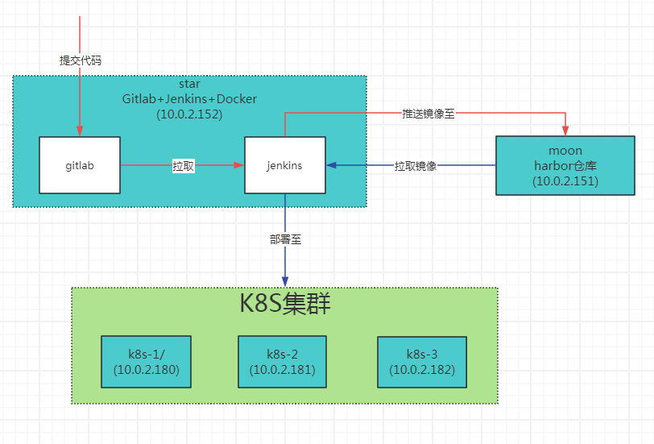

# k8s实战

> MobaXterm password：root123456

+ 

+ kubelet日志
  - journalctl -xefu kubelet
  - -x 显示完整的日志信息，包括堆栈跟踪和其他相关信息
  - -e 自动滚动到最新的日志条目。
  - -u kubelet 指定了要查看的日志单元（unit）
  - -f Follow the journal
