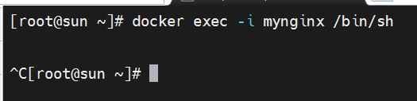
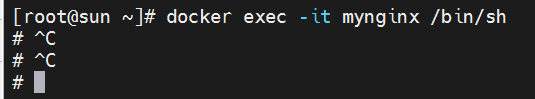
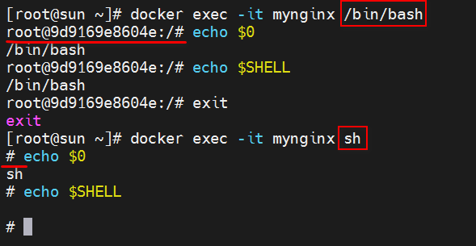

# docker常用命令

+ docker ps显示信息不全，解决方法
  - docker ps --no-trunc
  
+ 只显示容器ID
  - docker ps -q
  
+ 根据条件过滤显示的容器
  - docker ps -f "status=exited"

+ 显示名称包含 my_container 的容器
  - docker ps -f "name=my_container"  
  
+ 格式化输出
  - docker ps --format "table {{.ID}}\t{{.Names}}\t{{.Status}}"

+ 删除容器
  - docker rm 容器id

+ 删除镜像
  - docker rmi 镜像id

+ docker执行Dockerfile文件中的内容，在其之下maven打包时候，依赖下载的位置（在安装docker的服务器上执行）
  - find / -name "*.m2*" -type d
  - find . -name "*.jar" -printf "%f\n" (最后的 -printf "%f\n" 表示只输出文件名，而不包含路径)

+ 检索
  - docker search xx
+ 启动
  - docker start <container name or id>
+ 停止
  - docker stop <container name or id>
+ 状态
  - docker stats <container name or id>
+ 日志
  - docker logs <container name or id>
+ 删除
  - docker rm <container name or id>
+ 删除运行中的容器
  - docker rm -f <container name or id>

+ 查看镜像详情
  - docker image inspect nginx-v1:v1.0
+ 镜像历史
  - docker image history nginx-v2:v1.0
+ 镜像层大小
  - docker ps -s
  - 1.3kB (virtual 192MB) 读写层占用1.3kb，镜像大小192MB


+ 检查docker代理
  - systemctl show --property=Environment docker

+ 批量删除容器
  - docker rm -f $(docker ps -aq)

+ 目录挂载
  - docker run -d --name window -p 80:80 -v /root/docker_share/nginx_html:/usr/share/nginx/html -v /root/docker_share/nginx_conf:/etc/nginx lyle8341/lyle_nginx:v1.0
  - 除非已经创建了配置文件，解决方式：卷映射
+ 卷映射(卷名)
  - -v nginx_conf:/etc/nginx
  - /var/lib/docker/volumes/<nginx_conf>


### 运行容器


+ [端口映射](https://docs.docker.com/get-started/docker-concepts/running-containers/publishing-ports/#publishing-to-ephemeral-ports)
  - 指定映射端口
    - docker run -d -p HOST_PORT:CONTAINER_PORT nginx
  
  - publish the container’s port 80 onto an ephemeral port on the host
    - docker run -p 80 nginx
  
  - publish all of the exposed ports configured by the image
    - docker run -P nginx


### 进入容器
+ -t参数作用(-t, --tty		Allocate a pseudo-TTY)
  - 
  - without a pseudo-TTY attached,没有前面的＃号，ctrl+c就退出容器终端了
  - 
+ -i, --interactive		Keep STDIN open even if not attached, which prevents the sh process from exiting immediately

+ COMMAND bash和sh的区别
  


### Dockerfile编写
+ 方式一（每次都会下载jar依赖）
```dockerfile
# 第一阶段构建镜像
FROM openjdk:17-jdk-slim AS build
COPY pom.xml mvnw ./
COPY .mvn .mvn
RUN chmod +x ./mvnw
RUN ./mvnw dependency:resolve
COPY src src
RUN ./mvnw package

# 第二阶段构建镜像
FROM openjdk:17-jdk-slim
WORKDIR demo
# COPY --from=<builder> <src>... <dest>
# <builder>是之前构建的镜像的名称或ID。<src>...是要从构建的镜像中复制的源文件或目录，可以是多个。<dest>是目标路径。
COPY --from=build target/*.jar demo.jar
ENTRYPOINT ["java", "-jar", "demo.jar"]
```

+ 方式二
  + 先使用本地的maven进行编译成jar
  + 在直接使用jar
```dockerfile
FROM openjdk:17-jdk-slim
WORKDIR demo
COPY target/*.jar demo.jar
ENTRYPOINT ["java", "-jar", "demo.jar"]
```


### 用nginx制作一个自定义的nginx，发布
+ 1.提交 docker commit
  - docker commit -m "update index.html" <容器> <镜像:标签>
  - docker commit -m "update index.html" mynginx lyle_nginx:v1.0
+ 2.保存 docker save
  - docker save -o lyle_nginx.tar lyle_nginx:v1.0
+ 3.加载 docker load
  - docker load -i lyle_nginx.tar

+ 4.docker login
+ 5.docker tag lyle_nginx:v1.0 lyle8341/lyle_nginx:v1.0
+ 6.docker push lyle8341/lyle_nginx:v1.0
  - The push refers to repository [docker.io/lyle8341/lyle_nginx]
+ 7.反例docker push tutu/modify_nginx:v1.0(推送失败，因为tag的斜杠前面是用户名)
    - The push refers to repository [docker.io/tutu/modify_nginx]  
+ 8.docker pull lyle8341/lyle_nginx:v1.0
  ```
  v1.0: Pulling from lyle8341/lyle_nginx
  Digest: sha256:83cf7dcfc8bec4f930a6d5e97aa8555418c382e8e94fcef17cfcd3567d7e9883
  Status: Downloaded newer image for lyle8341/lyle_nginx:v1.0
  docker.io/lyle8341/lyle_nginx:v1.0  
  ```


### 自定义网络
+ 查看容器细节
  - docker container inspect app1
  - docker为每个容器分配唯一ip，使用容器ip+容器端口可以互相访问
  - docker0 默认网络不支持主机域名
+ 创建自定义网络
  - docker network create mynet
  - docker network ls
+ 创建容器
  - docker run -d -p 88:80 --name app1 --network mynet lyle8341/lyle_nginx:v1.0
  - docker run -d -p 99:80 --name app2 --network mynet lyle8341/lyle_nginx:v1.0
+ 使用域名访问
  - curl http://app2:80
  - curl http://app1:80

