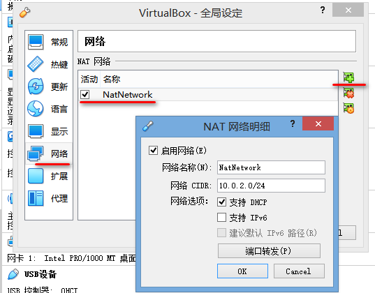
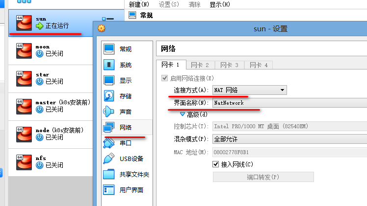
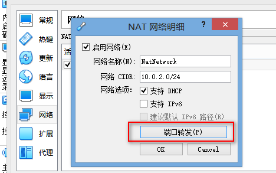
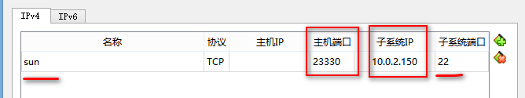
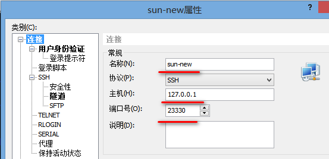

# 网络设置

> 之前用的是桥接网络，存在致命缺陷：当主机断网再恢复后，主机无法访问虚拟机

+ VirtualBox版本 6.1.50 r161033 (Qt5.6.2)

+ VirtualBox NAT Network的配置方法
  + 1.VirtualBox全局设置  
    
    
  + 2.虚拟机网络设置NAT Network
    
  + 3.启动虚拟机，设置虚拟机网络配置
    > $ vim /etc/sysconfig/network-scripts/ifcfg-enp0s3 注意这里的enp0s3是网卡的名字，每台机器可能不一样，换成你自己的
    ```shell
    将这个文件中的如下配置修改或添加成如下：
    BOOTPROTO=static
    ONBOOT=yes
    IPADDR=10.0.2.150
    NETMASK=255.255.255.0
    GATEWAY=10.0.2.1
    DNS1=114.114.114.114
    DNS2=8.8.8.8
    
    然后启动该网络设置
    $ systemctl restart network 或者
    $ service network restart
    ```
    + 3.1.备注
      ```
      上述配置中，因为在步骤1中的全局设置中，NAT局域网段设置为了10.0.2.0/24
      (也就是GATEWAY=10.0.2.1，NETMASK=255.255.255.0 24位子网掩码)，
      所以你设置的IPADDR必须是在这个网段内的地址。
      ```
    + 3.2.在虚拟机内部，测试一下`ping www.baidu.com`

  + 4.主机访问虚拟机，采用NAT端口映射
    > 在VirtualBox全局设置中，配置端口映射Port Forwarding (在步骤1中的NAT网卡设置)
    
    
    
  + 5.测试链接
    > ssh root@127.0.0.1 -p 23333 或者 ssh root@localhost -p 23333

    > 备注：**localhost不可以的话用127.0.0.1**
  + 6.工具连接  
    


  + [参考文档](https://floodshao.github.io/2019/07/03/2019-07-03-VirtualBox-NAT-Configuration/)
